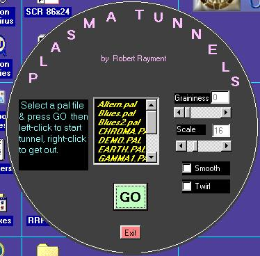



## Plasma Tunnels

### Description

Plasma Tunnels by Robert Rayment. (Now maximizable) VB+ASM. Win98 (see Plasma Worlds for other uses of plasmas) Zip 27KB
 
### More Info
 
Just run

Images

             |
---                |---
**Submitted On**   |2002-08-04 09:44:00
**By**             |[Robert Rayment](https://github.com/Planet-Source-Code/PSCIndex/blob/master/ByAuthor/robert-rayment.md)
**Level**          |Intermediate
**User Rating**    |4.9 (84 globes from 17 users)
**Compatibility**  |VB 6\.0
**Category**       |[Graphics](https://github.com/Planet-Source-Code/PSCIndex/blob/master/ByCategory/graphics__1-46.md)
**World**          |[Visual Basic](https://github.com/Planet-Source-Code/PSCIndex/blob/master/ByWorld/visual-basic.md)
**Archive File**   |[Plasma\_Tun114085842002\.zip](https://github.com/Planet-Source-Code/robert-rayment-plasma-tunnels__1-35645/archive/master.zip)

### API Declarations

Several see code

